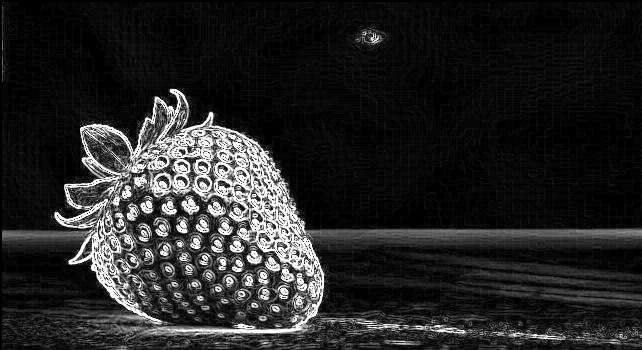

# Hardware Image Processor — RTL to GDSII (Sky130 ASIC)

A fully pipelined hardware Sobel edge detection image processing chip designed and implemented through the complete RTL-to-GDSII ASIC design flow using the open-source Sky130 HD PDK.

## Overview

The chip takes a 642×350 grayscale image from an on-chip ROM, streams pixels through a Sobel edge detection pipeline, and outputs a binary thresholded edge map. The design was verified at the RTL level, synthesized to Sky130 HD standard cells using Yosys, and implemented through full physical design using OpenROAD.

- **Image dimensions**: 642 × 350 pixels (224,910 total pixels)
- **Technology**: Google Sky130 HD Process (`sky130_fd_sc_hd`)
- **Clock**: 100 MHz

---

## Architecture

```
Image ROM → Pixel Stream → Line Buffer (×2) → 3×3 Window → Sobel Core → Gradient Magnitude → Threshold → Edge Output
```

| Module | Description |
|---|---|
| `image_rom` | Synchronous ROM storing the input image (read from `.mem` file) |
| `pixel_stream` | Sequential pixel address generator with x/y coordinate tracking |
| `line_buffer` | Circular FIFO that stores one full row (642 pixels) for 2D window formation |
| `window_3x3` | Assembles a 3×3 sliding pixel window from two line buffers |
| `sobel_core` | Computes Gx and Gy gradients using the Sobel kernel |
| `gradient_mag` | Approximates gradient magnitude: `\|Gx\| + \|Gy\|` |
| `threshold` | Binary threshold (>100 → white, else black) |
| `image_pipeline` | Top-level pipeline: window → sobel → gradient → threshold |
| `top` | Design top-level: ROM + pixel stream + pipeline |

---

## Repository Structure

```
hardware-img/
├── rtl/                    # Synthesizable Verilog RTL
│   ├── top.v
│   ├── image_pipeline.v
│   ├── image_rom.v
│   ├── pixel_stream.v
│   ├── line_buffer.v
│   ├── window_3x3.v
│   ├── sobel_core.v
│   ├── gradient_mag.v
│   └── threshold.v
├── tb/                     # SystemVerilog testbenches
│   ├── tb_top.sv           # Full pipeline simulation (222,720 pixels)
│   ├── tb_top_gls.sv       # Gate-level simulation testbench
│   ├── tb_sobel_core.sv
│   ├── tb_gradient_mag.sv
│   ├── tb_threshold.sv
│   ├── tb_line_buffer.sv
│   ├── tb_window_3x3.sv
│   ├── tb_pixel_stream.sv
│   └── tb_sobel_filter.sv
├── python_ref/             # Python golden reference model
│   ├── img.py              # Image to .mem file conversion
│   └── verify.py           # Output verification against OpenCV reference
├── constraints/
│   └── top.sdc             # Timing constraints (100 MHz clock)
├── scripts/
│   ├── synth.ys            # Generic Yosys synthesis script
│   └── synth_sky130.ys     # Sky130 HD technology mapping (Yosys + ABC)
├── openroad/               # Physical design flow (OpenROAD)
│   ├── run_flow.sh         # Automated 6-stage flow orchestration
│   └── scripts/
│       ├── setup.tcl       # PDK paths and design configuration
│       ├── 01_floorplan.tcl
│       ├── 02_place.tcl
│       ├── 03_cts.tcl
│       ├── 04_route.tcl
│       ├── 05_sta.tcl
│       └── 06_gds.tcl
├── reports/
│   └── yosys/              # Yosys synthesis reports
│       ├── stat.txt
│       ├── check.txt
│       └── hierarchy.txt
└── openroad/reports/       # Physical design reports
    ├── 03_cts_summary.rpt
    └── 03_cts_skew.rpt
```

---

## Design Results

### RTL Simulation

| Metric | Result |
|---|---|
| Simulator | Icarus Verilog (`iverilog -g2012`) |
| Pixels Processed | 222,720 |
| Mismatches vs Python Reference | 0 |
| Verilator Lint | 0 errors, 0 warnings |

### Output Comparison
| Input Image | Python Golden Model | Hardware RTL Output |
|---|---|---|
|  |  |  |


### Synthesis (Yosys + Sky130 HD)

| Metric | Value |
|---|---|
| Total cells | 79,968 |
| Flip-flops | 10,471 |
| Total wires | 70,809 |
| Technology | sky130_fd_sc_hd |
| Design check | 0 problems |

The largest contributor is `image_rom` (~60,779 cells), which stores the 642×350 pixel image fully synthesized as combinational ROM logic.

## Running the Design

### Prerequisites

- [Icarus Verilog](http://iverilog.icarus.com/) for RTL simulation
- [Verilator](https://verilator.org/) for lint checking
- [Yosys](https://yosyshq.net/yosys/) for synthesis
- [OpenROAD](https://openroad.readthedocs.io/) for physical design
- Sky130 PDK

### 1. Generate Image Memory File

```bash
cd python_ref
python3 img.py
```

### 2. RTL Simulation

```bash
iverilog -g2012 -o sim.out rtl/*.v tb/tb_top.sv
vvp sim.out
```

### 3. Verify Output Against Reference

```bash
python3 python_ref/verify.py
```

### 4. Synthesize to Sky130

```bash
# Set PDK_ROOT if not using the default local path
export PDK_ROOT=/path/to/sky130A
yosys scripts/synth_sky130.ys
```

### 5. Physical Design Flow

```bash
cd openroad
bash run_flow.sh
```

Each stage produces a checkpoint DEF in `results/` and a log in `logs/`.

---

## Design Flow Summary

```
Verilog RTL
    │
    ▼
Yosys (synth_sky130.ys)
Sky130 ABC Technology Mapping
    │
    ▼
Gate-Level Netlist (netlist/top_sky130.v)
    │
    ▼
OpenROAD Physical Design
  01 Floorplan → 02 Place → 03 CTS → 04 Route → 05 STA → 06 GDSII
```

---

## Tools Used

| Tool | Purpose |
|---|---|
| Icarus Verilog | RTL and gate-level simulation |
| Verilator | Lint verification |
| Yosys | Synthesis and Sky130 technology mapping |
| OpenROAD | Place & route, CTS, STA, GDSII |
| Sky130 HD PDK | Standard cell library |
| Python 3 + OpenCV | Golden reference model and verification |

---

## Notes

- `image_rom` is synthesized as combinational logic (no SRAM blocks) to remain fully compatible with Yosys open-source synthesis.
- `synth_sky130.ys` reads the PDK Liberty path from the `PDK_ROOT` environment variable for portability. If not set, it falls back to the local ciel-installed path.
- Physical design was run on a consumer laptop (8 CPU threads, integrated graphics). Routing ~100k standard cells with TritonRoute is compute-intensive and may take several hours.