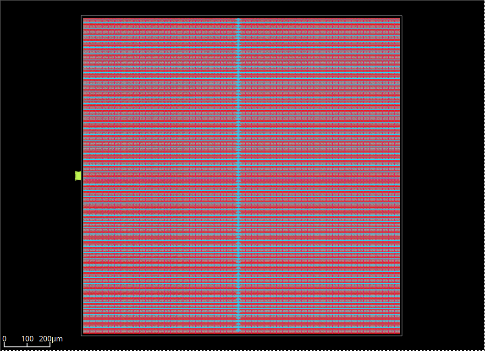

# Hardware Image Processor - RTL to GDSII (Sky130 ASIC)

A pipelined hardware Sobel edge detection accelerator designed and implemented through the complete RTL-to-GDSII ASIC design flow using the open-source Sky130 HD PDK.

## Overview

The chip takes a 642x350 grayscale image from an on-chip ROM, streams pixels through a Sobel edge detection pipeline, and outputs a binary thresholded edge map. The design was verified at the RTL level, synthesized to Sky130 HD standard cells using Yosys, and implemented through full physical design using OpenROAD.

- Image dimensions: 642 x 350 pixels (224,910 total pixels)
- Technology: SkyWater 130nm HD Process (sky130_fd_sc_hd)
- Target Clock: 33 MHz (30 ns period)

---

## Architecture

```
Image ROM -> Pixel Stream -> Line Buffer (x2) -> 3x3 Window -> Sobel Core -> Gradient Magnitude -> Threshold -> Edge Output
```

| Module | Description |
|---|---|
| `image_rom` | Synchronous ROM storing the input image (loaded from memory file) |
| `pixel_stream` | Sequential pixel address generator with x/y coordinate tracking |
| `line_buffer` | Circular FIFO storing one full row (642 pixels) for 2D window formation |
| `window_3x3` | Assembles a 3x3 sliding pixel window from two line buffers |
| `sobel_core` | Computes Gx and Gy gradients using the Sobel kernel |
| `gradient_mag` | Approximates gradient magnitude: |Gx| + |Gy| |
| `threshold` | Binary thresholding (>100 -> white, else black) |
| `image_pipeline` | Top-level pipeline: window -> sobel -> gradient -> threshold |
| `top` | Top-level design: ROM + pixel stream + pipeline |

---

## Repository Structure

```
hardware-img/
├── rtl/                    # Synthesizable Verilog RTL
│   ├── top.v
│   ├── image_pipeline.v
│   ├── image_rom.v
│   ├── pixel_stream.v
│   ├── line_buffer.v
│   ├── window_3x3.v
│   ├── sobel_core.v
│   ├── gradient_mag.v
│   └── threshold.v
├── tb/                     # SystemVerilog testbenches
│   ├── tb_top.sv           # Full pipeline simulation
│   ├── tb_top_gls.sv       # Gate-level simulation testbench
│   ├── tb_sobel_core.sv
│   ├── tb_gradient_mag.sv
│   ├── tb_threshold.sv
│   ├── tb_line_buffer.sv
│   ├── tb_window_3x3.sv
│   └── tb_pixel_stream.sv
├── python_ref/             # Python golden reference model
│   ├── image_to_mem.py     # Image to .mem file conversion
│   └── verify.py           # Output verification against OpenCV reference
├── constraints/
│   └── top.sdc             # Timing constraints (33 MHz clock)
├── scripts/
│   └── synth_sky130.ys     # Sky130 HD technology mapping (Yosys + ABC)
├── openroad/               # Physical design flow (OpenROAD)
│   ├── run_flow.sh         # Automated 6-stage flow orchestration
│   └── scripts/
│       ├── setup.tcl       # PDK paths and design configuration
│       ├── 01_floorplan.tcl
│       ├── 02_place.tcl
│       ├── 03_cts.tcl
│       ├── 04_route.tcl
│       ├── 05_sta.tcl
│       ├── 06_gds.tcl
│       └── view.tcl
├── reports/                # Yosys synthesis reports
└── docs/images/            # Layout and verification outputs
```

---

## Design Results

### RTL Simulation

| Metric | Result |
|---|---|
| Simulator | Icarus Verilog (`iverilog -g2012`) |
| Pixels Processed | 222,720 |
| Mismatches vs Python Reference | 0 |
| Verilator Lint | 0 errors, 0 warnings |

### Synthesis (Yosys + Sky130 HD)

| Metric | Value |
|---|---|
| Total cells | 79,968 |
| Flip-flops | 10,471 |
| Total wires | 70,809 |
| Technology | sky130_fd_sc_hd |
| Design check | 0 problems |

The largest contributor is `image_rom` (~60,779 cells), which stores the 642x350 pixel image fully synthesized as combinational ROM logic.

### Physical Design (OpenROAD + Sky130 HD)



| Metric | Value |
|---|---|
| Core Area | 904,200 um^2 (~0.9 mm^2) |
| Utilization | 48% |
| Post-route Instances | 302,929 |
| Standard Cells | 69,415 |
| Flip-flops | 10,471 |
| Clock Buffers | 1,435 |
| Setup Slack | +0.87 ns |
| Hold Slack | +0.34 ns |
| Total Power | 98.4 mW |

---

## Running the Design

### Prerequisites

- Icarus Verilog for RTL simulation
- Verilator for lint checking
- Yosys for synthesis
- OpenROAD for physical design
- Sky130 PDK

### 1. Generate Image Memory File

```bash
cd python_ref
python3 image_to_mem.py
```

### 2. RTL Simulation

```bash
make sim
```

### 3. Verify Output Against Reference

```bash
make verify
```

### 4. Synthesize to Sky130

```bash
make synth
```

### 5. Physical Design Flow

```bash
make flow
```

Each stage produces a checkpoint DEF in `results/` and a log in `logs/`.

### 6. View Layout

```bash
make view
```

---

## Design Notes

- `image_rom` is synthesized as combinational logic (no SRAM blocks) to remain fully compatible with Yosys open-source synthesis.
- `synth_sky130.ys` reads the PDK Liberty path from the `PDK_ROOT` environment variable for portability. If not set, it falls back to the default installed path.
- The design achieves timing closure at 33 MHz (+0.87 ns setup slack).
